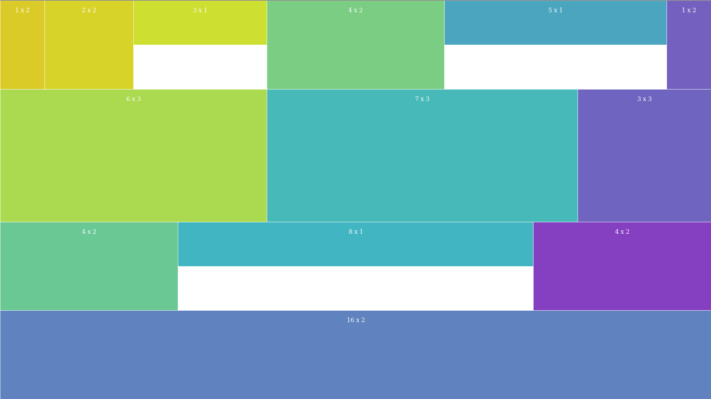

# flexgrid

flexbox-based grid system for older browsers.



I don't think that it's production ready software *yet*. But feel free to test it and improve it! :)
Use `Issues` tab to share your ideas etc!

## Usage

```sh
npm install flexgrid
```

Import in project and use classes.

### Classes

Name | Example | Description
--- | --- | ---
`fg` | `fg` | Container
`fg-w-X` | `fg-w-1` | Set width of child. Replace `X` with number.
`fg-h-X` | `fg-h-2` | Set height of child. Replace `X` with number.

#### Examples

1. Container with one child 5x4

```html
<div class="fg">
  <div class="fg-w-5 fg-h-4"></div>
</div>
```

1. Container with 4 even rows and 3 even columns (if used default grid is 16x9)

```html
<div class="fg">
  <div class="fg-w-4 fg-h-3"></div>
  <div class="fg-w-4 fg-h-3"></div>
  <div class="fg-w-4 fg-h-3"></div>
  <div class="fg-w-4 fg-h-3"></div>

  <div class="fg-w-4 fg-h-3"></div>
  <div class="fg-w-4 fg-h-3"></div>
  <div class="fg-w-4 fg-h-3"></div>
  <div class="fg-w-4 fg-h-3"></div>

  <div class="fg-w-4 fg-h-3"></div>
  <div class="fg-w-4 fg-h-3"></div>
  <div class="fg-w-4 fg-h-3"></div>
  <div class="fg-w-4 fg-h-3"></div>
</div>
```

1. Please check out `demo/index.html`

## Own grid

Main build is 16x9 grid. But you can create own grid!

### Command line

1. Clone repo
1. Install dependencies (`npm install`)
1. Run command:

```sh
npx lessc --modify-var='c=NUMBER OF COLUMNS' \
          --modify-var='r=NUMBER OF ROWS' \
          --modify-var='g=GAP SIZE' \
          src/fg.less dist/fg.css
```

E.g. Grid 4x3 with gap size 2px:

```sh
npx lessc --modify-var='c=4' \
          --modify-var='r=3' \
          --modify-var='g=2px' \
          src/fg.less dist/fg.css
```

### Within LESS file

1. Install (`npm install flexgrid`)
1. Import in LESS:

```less
@import 'flexgrid/flexgrid.less';
```

1. Run mixin:

```less
.flexgrid(@numberOfColumns, @numberOfRows, @gapSize);
```

E.g. Grid 4x3 with gap size 2px:

```less
.flexgrid(4, 3, 2px);
```
